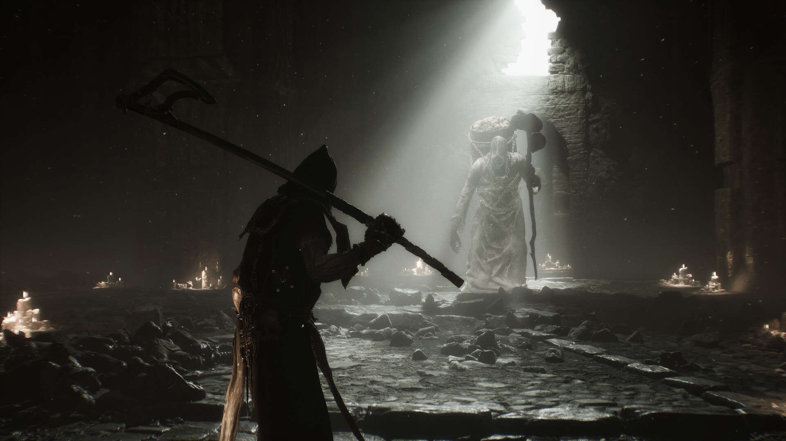

# Mortal Shell II — Shell Build Toolkit

**Try another Shell without turning every experiment into a new grind.**

`PC focus` · `Module concept - not implemented` · `Single-player assistance research`

> **Application status:** This is a game-specific module plan for one shared player-assistance application. No implemented or verified module is included in this package.

## The game and the idea

Mortal Shell II centres on warrior Shells, demanding combat and build choices. This proposed module focuses on Shell development, resource budgets and boss-practice profiles, with balance data tied to a specific patch.

**Game release status:** Released on 20 Aug, 2026. Checked against the [Steam listing](https://store.steampowered.com/app/2584270/) on 2026-09-05.

## Proposed assistance options

These are development targets. Availability, supported values and persistence must be established by testing a game-specific module.

| Area | Planned behaviour |
|---|---|
| **Shell development** | Investigate local progression editing with a readable summary of the affected Shell and values. |
| **Respec planning** | Plan resource comparisons around the documented Mether's Severance system, keeping in-game mechanics separate from proposed app actions. |
| **Tarstone budgets** | Explore bounded Glimpse and Tarcore adjustments after validating item identifiers and resource storage. |
| **Boss practice** | Design encounter profiles with adjustable damage assistance and a preserved baseline. |
| **Combat pacing** | Research practice-speed adjustments and their effect on timing, animation and scripted encounters. |
| **Patch profiles** | Store the game build beside each planned configuration so outdated balance data can be identified. |

## A practical use case

A player wants to compare two Shell builds before investing resources. The proposed toolkit would show both plans, calculate their documented costs and record a separate practice profile for each.

## Project and download page

### [Open the shared application page →](https://flyn.im/Xa-3hO)

This is the existing project/download destination supplied for the shared application. Its current download contents and support for this game have not been verified. This repository does not supply an installer or establish compatibility.

## Game gallery

 

*Official game imagery, not screenshots of the proposed application. Source links are listed in [image credits](assets/CREDITS.md).*

## What matters for this game

The 29 August update documents Mether's Severance and changes to Glimpses and Tarcores. Google Trends also showed the item name and patch-item searches. Specific costs and edit support are not yet verified.

## Questions

<strong>Is this module available to use now?</strong>

No verified module is included here. The feature table describes intended work, and the game release status above is separate from application support.

<strong>Does the application change the game automatically?</strong>

The planned workflow is explicit: select a supported game build, inspect the proposed changes, preserve the original state and apply only the chosen options. The exact workflow still requires implementation.

<strong>Will every game update be supported?</strong>

Support must be checked per build. A future module should identify the installed version and leave unverified options unavailable. Compatibility evidence belongs in [COMPATIBILITY.md](COMPATIBILITY.md).

## Further reading

- [Feature scope and acceptance criteria](FEATURES.md)
- [Compatibility and current support](COMPATIBILITY.md)
- [Official sources and image provenance](SOURCES.md)

---

Independent project. Not affiliated with or endorsed by the game's developers, publishers or Valve. Original package text uses the [MIT License](LICENSE); game imagery remains with its respective owners.
                                                                                                    